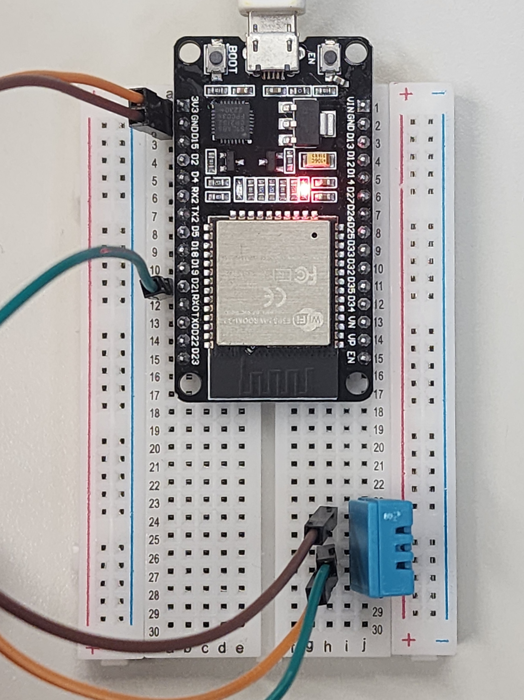
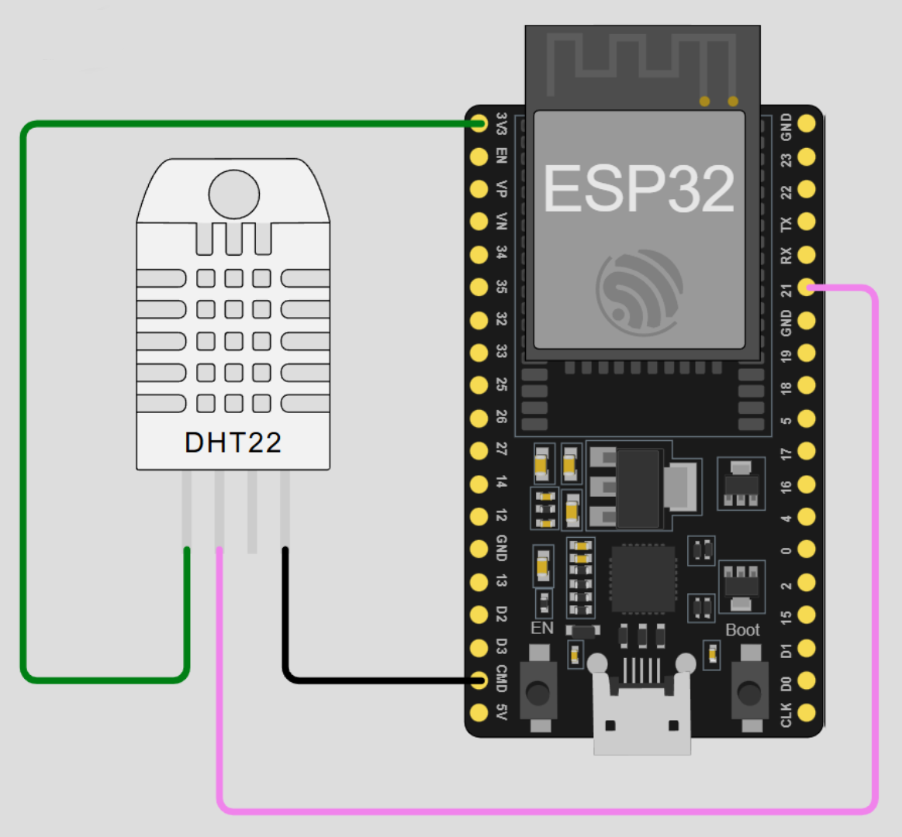

# Sensor-de-Temperatura-e-Umidade

Este projeto mostra como utilizar o **sensor DHT11** com o **ESP32** para medir temperatura e umidade.

---

## 🔌 Conexão do DHT11 ao ESP32

O sensor DHT11 possui **3 pinos principais**:  

- **VCC** → 3.3V
- **GND** → GND do ESP32  
- **DATA (OUT/S)** → GPIO do ESP32 (no exemplo, utilizamos o **pino 21**)  

---

## 📷 Fotos do Sistema

| Sensor e ESP32 Conectados | Versão Digital |
|---------------------------|----------------|
|  |  |


---

## 📦 Biblioteca Utilizada

Este código utiliza a biblioteca **Bonezegei_DHT11**, criada por **Jofel Batutay (Bonezegei)**.  

Instalação pelo **Arduino IDE**:  

1. Vá em `Sketch > Incluir Biblioteca > Gerenciar Bibliotecas`  
2. Pesquise por **Bonezegei_DHT11** e instale  

Ou baixe diretamente do repositório oficial do autor.

---

## 💻 Código de Exemplo

```cpp
#include <Bonezegei_DHT11.h>

Bonezegei_DHT11 dht(21); // pino do DHT11

void setup() {
  Serial.begin(115200);
  dht.begin();
}

void loop() {
  if (dht.getData()) {                         
    float tempDeg = dht.getTemperature();      
    float tempFar = dht.getTemperature(true);  
    int hum = dht.getHumidity();               

    String str  = "Temperature: ";
           str += tempDeg;
           str += "°C  ";
           str += tempFar;
           str += "°F  Humidity:";
           str += hum;

    Serial.println(str.c_str());
  }

  delay(1000);  // delay mínimo de 2s para leitura confiável
}
```
---

## ✅ Conclusão

Se tudo estiver conectado corretamente e o código corretamente carregado no ESP32, você deverá obter **leituras em tempo real de temperatura e umidade** no Serial Monitor.  

Este projeto permite monitorar facilmente as condições ambientais usando o **DHT11** e o **ESP32**, servindo como base para projetos de **automação residencial**, **estação meteorológica** ou **monitoramento de ambiente**.  

Sinta-se à vontade para expandir este projeto, integrando com displays, bancos de dados ou sistemas IoT para registrar e visualizar os dados de forma mais completa.
